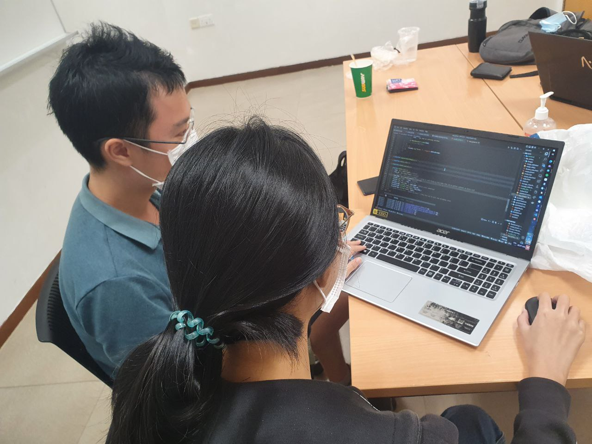

# SPM-G1T1
 
<!-- TABLE OF CONTENTS -->
<details id="contents" >
  <summary>Table of Contents</summary>
  <ol>
    <li>
      <a href="#about-the-project">About The Project</a>
      <ul>
        <li><a href="#project-management">Project Management</a></li>
      </ul>
    </li>
    <li>
      <a href="#built-with">Built With</a>
      <ul>
        <li><a href="#tech-stack">Tech Stack</a></li>
        <li><a href="#packages-and-libraries-used">Packages Used</a>
            <ul>
                <li><a href="#frontend-general">Frontend (General)</a></li>
                <li><a href="#backend">Backend</a></li>
                <li><a href="#automated-testing">Automated Testing</a></li>
            </ul>
        </li>
      </ul>
    </li>
    <li>
      <a href="#getting-started">Getting Started</a>
      <ul>
        <li><a href="#create-the-env-file">Prerequisites</a></li>
	    <li><a href="#to-start-our-application-locally">Start our App locally</a></li>
        <li><a href="#additional-notes-from-first-release">Additional Notes From First Release</a></li>
      </ul>
    </li>
    <li><a href="#acknowledgments">Acknowledgments</a></li>
  </ol>
</details>

<!-- PROJECT LOGO -->
<br />
<div align="center">
  

  <p align="center">
    <b><i>A software project managed by scrum</b>, IS212 Software Project Management G1T1</i>
  </p>
</div>

<br>

# About the Project
Learning Journey Planning System is a software that aims to allow staffs to plan their learning journey based on their learning goals.

Our application covers the five core features
that the Product Owner and customer would like to see addressed in your first release
1. Users should be able to select a role they want and see a list of skills required
1. Users should be able to see the courses they can take to acquire those skills, and
add/remove them on their learning journey
1. CRUD for roles
1. CRUD for skills
1. Assigning skills to roles; assigning skills to courses

## Project Management
Without a sustainable method of managing our Software Development Process, changing requirements from clients will eventually lead to a software the client is not looking for.

Our project therefore, focuses on managing our coding activities using Scrum, calibrated to
the velocity of our team’s developers.

<p align="right"><<<a href="#contents">back to top</a>>></p>

# Built With

## Tech Stack

* [Python](https://docs.python.org/3/)
* [Flask](https://flask.palletsprojects.com/en/2.2.x/)
* [Javascript](https://developer.mozilla.org/en-US/docs/Web/JavaScript)
* [MySQL](https://dev.mysql.com/doc/)

## Packages and Libraries Used
### Frontend (General)
* [jQuery](https://api.jquery.com/)
* [Bootstrap](https://getbootstrap.com/docs/4.1/getting-started/introduction/)

### Backend
* [SQLAlchemy](https://docs.sqlalchemy.org/en/14/) - For linking the communication between our Python programs and database.
* [Flask-CORS](https://flask-cors.readthedocs.io/en/latest/) - Handles Cross Origin Resource Sharing (CORS), making cross-origin AJAX possible.

### Automated Testing

* [Flask-Testing](https://pythonhosted.org/Flask-Testing/) - For testing our application using unittest.
* [selenium](https://pypi.org/project/selenium/) - Automated tests using Python from web browser interactions.


<p align="right"><<<a href="#contents">back to top</a>>></p>

# Getting Started
## Create the .env file
Create your .env file with the following variables in the /backend/server folder.
- DB_USERNAME = \<insert your php my admin DB username\>
- DB_PASSWORD = \<insert your php my admin DB password\>

## To start our application locally,
1. Start WAMP/MAMP
2. import the sql tables with php my admin in this order
    1. backend/sql/createTables.sql 
    2. backend/sql/insertDataSetA.sql (our own test data)
    3. backend/sql/insertDataSetB.sql (test data given to us on elearn)
3. Ensure a copy of the .env file in the right directory (refer to <a href="#create-the-env-file">Create the .env file</a>)
4. run the server /backend/server/flaskServer.py
    ```bash
    cd backend/server
    python flaskServer.py
    ```
5. run the frontend with live server /frontend/index.html
    alternatively, move the whole folder to /www. in WAMP/MAMP and run the run the frontend with WAMP/MAMP 

## Additional Notes From First Release
<b>Login and password management to be completed in further releases</b>

When logging in:
* select the role you want to view the pages (as different roles has different access rights in the application).
* Select any email from the dropdown list (no password needed)
* Select <b>"Login"</b>

<p align="right"><<<a href="#contents">back to top</a>>></p>

<!-- ACKNOWLEDGMENTS -->
# Acknowledgments

* [Zhang, Yimei](https://github.com/YimeiZhang)
* [Teh Xue Er](https://github.com/tehxueer29)
* [Shaan Walia](https://github.com/mxixqc)
* [Paul Soh Wei Jie](https://github.com/blazefire710)
* [Chen Tianyu](https://github.com/tame12)
* [Yap En Rui Andrea](https://github.com/andreayup)

<p align="right"><<<a href="#contents">back to top</a>>></p>
